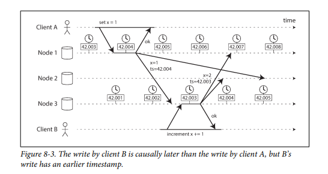
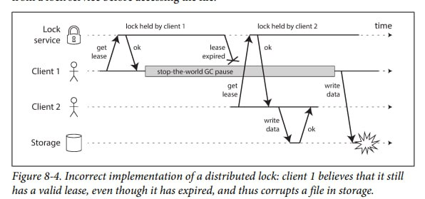
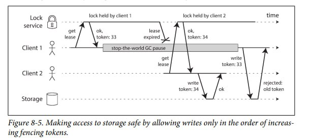

# Chapter 1
- faults != fails. fail - полная остановка, fault - ошибка в одном компненте.
- Основные типы faults
  - Hardware faults
    - причины:
      - периодически состовляющие компьютеров выходят из строя
    - решение:
      - изначально разрабатывать систему так, чтобы поломка одной машины не мешала работе системы в целом
    - дублирование компонентов машины
      - 1 запасной источник питание
      - запасное CPU
      - запасной жёсткий диск
  - Software Error
    - причины:
      - ошибка в программе
    - проблемы:
      - ошибка в одном компоненте может повлиять на ошибки в других компонентах
      - каскадные ошибки. Один компонент не работает -> остальные тоже перестают
      - подобные проблемы выясняются обычно не сразу. Программа может несколько лет проработать без проблем, но при стечении определённых обстоятельств рухнуть.
      - тяжело найти причину
    - решение:
      - нет конкретного решения, но некоторые практики позволяют снизить риск такой ошибки:
        - юнит тестирование
        - тестирование системы целиком
        - изоляция процессов
        - анализ системы в процессе работы
        - программа может сама проверять свою работу
  - Human Errors
    - причины:
      - человеческий фактор
    - решение:
      - Уменьшить возможности для ошибки. Например, продуманное API, абстракция, админ панель
      - Декаплить (decouple) системы, где велика вероятность человеческой ошибки, от систем, которым ошибка может навредить
      - Тестирование юнитов и всей системы в целом
      - Возможность быстро откатить ошибки
      - Мониторинг

Разница между latency (задержка) и response time (время ответа):
- в `response time` входит всё время, начиная с отправки запроса и заканчивая получение ответа
- `latency` это время, в течение которого запрос ждёт, чтобы его обработали. 

response time этто не конкретная величина, а целый набор величин для измерения. 


Обычно для анализа response time сначала создаётся отсортированный список со временем всех запросов. А затем находится percentile:
- допустим, статистика response time = [1, 1, 2, 5, 11]
- возьмём percentile 50 (p50) - 2
- это значит, что в 50% response time меньше 2 секунд, а остальные 50% больше 2 секунд
- если взять percentile 80, то получем 5
- это значит, что в 80% response time меньше 5 секунд, но в остальных 20% response time больше 5 секунд

- SLA задаёт минимум для response time и других параметров работы сервиса. Если SLA нарушается, то клиент может потребовать возврата денег. Например, p50 должен быть <= 0.2, p999 (99.9) <= 1.
- Важно замерять response time на стороне клиента, потому что на response time может влиять Queueing delays (время, которое требуется пакету для передачи через сеть). Помимо этого может происходить head-of-line blocking.
- При тестировании системы важно отправлять запросы, не дожидаясь ответа на предыдущей, чтобы тестирование было более приближенно к реальности.

- Если действие пользователя включает в себя много запросов к бекенду, то важно помнить, что итоговое время во много определяется самым долгим запросом. Если 5 запросов заняли 0.01 секунду, но последний запрос занял 2 секунды, то действие будет выполняться медленно. Это называется `Tail latency amplification`.
- Если требуется отслеживать percintile по response time, то стоит использовать специальные алгоритмы (forward decay, t-digest, HdrHistogram), потому что каждый раз заново сортировать список всех response time - это неэффективно.

- scaling up = vertical scaling = shared nothing architecture = moving to more powerful machine.
- scaling out = horizontal scaling = distributing the load across multiple smaller machines.
- существуют `elastic` системы, которые автоматически добавляют ресурсы компьютера при большой нагрузке. Подобные системы полезны в тех случаях, если нагрузка непредсказуема. Однако увелечение ресурсов системы гораздо проще и меньше вероятность сюрпризов.

- гораздо проще заниматься scaling'ом stateless систем

# Chapter 8: The Trouble With Distributed Systems
- Всё, что может пойти не так, пойдёт не так.
- В этой главе рассказывается о возможных проблемах распределённых систем.

## Faults and Partial Failures
- Если программа пишется для запуска на одном компьютере, то всё просто. Если программа написана правильно, то всё будет работать правильно. Если в работе машины произошла ошибка, то она падает полностью. Если в CPU передать одни входные данные, то всегда получешь тот же выход. **Всё просто!**
- Однако в распределённых системах всё гораздо сложнее. 
Может произойти `partial failure`, когда не работает только один компонент, но в целом система работает нормально. 
- Проблема с `partial failure` заключается в том, что он `non-deterministic`: т.е. иногда запускаешь несколько нодов и всё работает правильно, а иногда неожиданно всё падает. 
- `partial failure` и `non-determinism` - основные проблемы при работе с распределёнными системами

### Network congestion and queueing
Зачастую задержки доставки пакетов происходят из-за очередей:
- Если множество нодов отправляют запрос на один нод, то может произоайти переполнение очереди. В таком случае запросы начинают просто отбрасываться, несмотря на то, что сеть в целом работает исправно
- Если все CPU cores (ядра процессора?) заняты, то ОС помещает запрос в очередь. Время нахождения в этой очереди может продолжаться произвольное количество времени.
- Если на машине запущено несколько виртуальных машин, то ОС может быть остановлена на примерно 10 милисекунд, пока другая ВМ использует CPU core (ядро процессора?)
- TCP занимается `flow control` (управление потоком, также называется: congestion avoidance и backpressure), чтобы не перегрузить нод получателя или линию сети. Это значит, что дополнительное создание очередей происходит даже в отправителе.

После определённого времени после отправки пакета TCP считает его утерянным и начинает его отправить снова и снова. Т.к. это происходит на уровне TCP, то приложение не замечает этих переотправок, но зато замечает задержку в отправке пакета. 

UDP
- UDP - хороший баланс между надежностью в тех случаях, когда не страшно недополучить/недоотправить часть пакетов.
- UDP не занимается `flow control`
- Не занимается переотправкой потерянных пакетов
- UDP позволяет избегать многих причин, по которым могут происходить задежки отправки пакетов.
- хорошо подходит для аудио/видео созвонов

определить оптимальный timeout можно только экспериментаальным путём. В идеале лучше использовать механизм для автоматического определения оптимального `timeout` в зависимости от текущего распределения времени ответов.

## Synchronous vs. Asynchronous Networks


## Unreliable Clocks
Часы и время ккрайне важная вещь для распределённых систем. Они позволяют ответить на вопросы:
- Прошёл ли timeout для запроса?
- Какая 99-ая процентиль для `response time`
- Сколько времени пользователь провёл на нашем сайте
....

Есть специальный механизм для синхронизации времени между машинами - `NTP`

### Monotonic vs Time-of-Day Clocks
В компьютере есть 2 типа времени:
- monotonic 
  - позволяет точно высчитать `elapsed time`, время выполнения программы, функции, запроса...
  - никогда не может пойти в обратную сторону
  - обычно отсчитывается от начала запуска копмьютера
  - **ОДНАКО**, если в компе несколько CPU, то monolitic time этих CPU могут быть не синхронизированы. Для запущенных приложений ОС старается синхронизировать эти CPU времена, однако не нужно на это надеятся слишком много.
- time-of-day
  - выглдяит как обычные время, которым мы пользуемся в жизни
  - обычно отсчитывается от эпохи (напр. 1 января 1970 года)
  - синхронизируется с помощью `NTP`
  - может уменьшиться (например, при изменении часового пояса)
  - на time-of-day влияют `leap seconds`

`leap seconds` - дополнительные секунды, которые добавляются в июня или декабря. За счёт них время совпадает с фактическим вращением Земли.
- когда добавляется `leap second`, то между 23:59:59 и 00:00:00 добавляется 23:59:60
- если это не учитывать, то система может рухнуть

### Clock Synchronization and Accuracy
- Кварцовые часы являются некорректными, они `drifts` (спешат или отстают).
- NTP сервер может выдавать некорректное время, поэтому важно запрашивать время с нескольких серверов не учитывать выбросы
- Если время компьютера слишком отличается от времени NTP сервера, то он может отказать в синхронизации или принудительно сбросить время компа.

### Relying on Synchronized Clocks
- Нельзя полностью полагаться, что time-of-day часы работают корректно
- Нужно мониторить, что у всех нодов одинаковое время. Нод, у которого время сильно отличается от остальных, должен считаться мёртвым.

`pitfalls` - подводные камни.


## Unreliable Clocks
- `clock skew` - разница между time-of-day часами на разных нодах в одной системе.
### Relying on Synchronized Clocks
#### Timestamps for ordering events
Самые популярные способы репликации данных при работе с БД:
- single-leader replication — классическая модель "ведущий-ведомый", при которой все записи проходят через один узел.
- multi-leader replication — все узлы равноправно принимаю изменения, реплицируя друг другу.
- leaderless replication — все узлы равноправно принимают изменения, передавая их друг другу с помощью кворумов и других механизмов.

Однако, при `multi-leader` и `single-leader` подходах есть вероятность конфликтов при записи. Например, в одном ноде x=1, во втором ноде x=3, как их привести к консенсусу?
- `LWW` - last write wins. Это стратегия разрешения конфликтов при записи данных.
- При данной стратегии последнее изменение считается самым верным. 
- Последним изменением считается изменение с наибольшим timestamp.
- timestamp берётся у того нода, на который запрос об изменении данных пришёл первым.
  - **Проблема:** может возникать `time skew` (расхождение по времени) между нодами, поэтому за последнее изменение может засчитаться изменение той машины, у которой просто спешат часы.

  - **Решение:** стоит использовать `logical clocks`. `logical clocks` используют не физическое время, а порядковый номер события.

#### Clock readings have a confidence interval
- ОС может отдавать время с большой точностью (хоть наносекунды), однако это не так важно, если time drift равен 5ти секундам.
- Куда важнее - знать размер ошибки и где примерно находится настоящее текущее время. Например, система могла бы быть уверена на 95%, что текущее время между 10.3 и 10.5 секундами.
- Однако, данная информация не предоставляется автоматически. Это можно посчитать только основываясь на разнице между временем на машине и временем, полученным с NTP сервера. Однако это тоже не может дать точного ответа, потому что неизвестно, сколько шёл ответ с NTP сервера.
- В Spanner существует TrueTime от Google, который явно указывает confidence interval (интервал уверенности?). Когда запрашиваешь текущее время, то он возвращает 2 значения [earliest, latest] (earliest and latest possible timestamps). Однако, вроде это только для Spanner.

#### Synchronized clocks for global snapshots
- Нам часто нужно создавать `snapshot` текущего состояние БД. 
- Для этого используются транзакции. Они не останавливают read и write процессы, но при этом дают изоляцию от них. Как это достигается?
  - У каждой транзакции есть transaction ID.
  - Если запись была сделана во время транзакции с большим ID, чем у текущей, то эта транзакция не видна текущей.
- **Проблема:** Как синхронизировать распределённые БД?
- **Решение:** Как-то синхронизировать по времени, однако непонятно как это сделать (учитывая все вышеперечисленные проблемы time-of-day)
Как сделали в Spanner (google)?
- Используют TrueTime для того, чтобы определять примерное начало и конец транзакций. 
- Если времена (earliest, latest) двух транзакций не пересекаются, то всё просто: та, что произошла раньше, не в курсе о второй
- Если времена двух транзакций пересекаются: ждём, пока первая транзакция завершится (пока не наступит latest), потом уже создаём вторую транзакцию. Таким образом их 

### Process Pauses
- Процесс (программа) может быть приостановлена в любую секунду, а затем продолжить работу, например, через 10 секунд. 
- Это может произойти по большому ряду причин:
  - Включился Garbage Collector (GC) и остановил выполнение кода на какое-то время
  - Другой поток забрал управление на долгое время
  - Если программа запущена в виртуальной машине, то она может быть полностью остановлена на довольно долгое время, например, гипервизором (`hypervisor`).
  - Если система может использовать `swapping to disk` (`paging`), то может произойти `thrashing`. 
    - `swapping to disk` - механизм виртуальной памяти, при котором отдельные фрагменты памяти перемещаются из ОЗУ в жёсткий диск и наоборот.
    - `thrashing` -  это состояние, при котором система превышает свою память и постоянно swapping данные между RAM и жёстким диском.
  - Процесс может быть остановлен сигналом SIGSTOP и возобновлён SIGCONT
- Чтобы спроектировать надёжную систему, надо рассчитывать на худшее. 
- Поэтому нод всегда должен предполагать, что он может быть остановлен.

Пример ситуации:
  - Представим, что у нас database with single leader per partition.
  - Только лидер может принимать запросы на запись
  - Как определить лидера?
    - Лидер регулярно запрашивает у других нодов, является ли он до сих пор лидером:
```java
while (true) {
 request = getIncomingRequest();
 // Ensure that the lease always has at least 10 seconds remaining
 if (lease.expiryTimeMillis - System.currentTimeMillis() < 10000) {
  lease = lease.renew();
 }
 if (lease.isValid()) {
  process(request);
 }
}
```
  - Теперь **проблема:** что если у лидера код будет остановлен на 30 секунд на строке `lease.isValid`? 
    - Он будет думать, что он до сих пор лидер и сделает запись, хотя за эти 30 секунд скорее всего лидер уже поменялся.

#### Limiting impact of garbage collection
- Garbage Collection может начаться в любой момент работы программы. Это останавливает работу программы. 
- Как нивелировать эффект от него?
  - Можно рассматривать Garbage Collection, как намеренную необходимую остановку нода.
    - Например, если нод знает, что ему скоро нужно сделать сборку мусора, то он предупреждает клиента, чтобы тот начал обращаться к другим нодам. Когда ноду перестанут приходить запросы, то тогда он уже сделает сборку.
    - Или сделать по-другому. Создавать только short-lived объекты (которые быстро собираются сборщиком) и периодически перезапускать процесс, пока не наберётся достаточно long-lived объектов, которые требуют полной GC.

## Knowledge, Truth, and Lies
В этом разделе будут описаны понятия знания и истины в контексте распределённых систем.

### The Truth Is Defined by the Majority
- **Проблема:** Как решить, мёртв нод или нет?
- **Решение:** Устроить Quorum между нодами, чтобы решить объявлять нод мёртвым или нет. 
  - Обычно, если более 50% процентов голосуют за то, что нод мёртв, то он объявляется мёртвым.

#### The leader and the lock
Бывают ситуации, когда в системе должно быть что-то в единственном экземпляре:
- иногда пользовательские имена не должны повторяться 
- только один пользователь может иметь `lock` на определённый ресурс

Может возникнуть следующая **проблема**:

 

Пояснение: пользователь думал, что lock находится у него, однако он уже устарел из-за приостановки программы. Он обращается к файлу, что его изменить, хотя уже второй пользователь получил `lock` на этот файл.

#### Fencing tokens
- **Решение:** вместе с локом передавать номер этого лока. 
- Каждый раз, когда `Lock service` возвращает лок, то он также возвращает и номер лока. Номер каждый раз увеличивается. 
- `Storage` запоминает номер последнего лока и, если `Storage` получит лок с номером меньше последнего, то он его отбрасывает.



- такой номер называется `fencing token`

### Byzantine Faults
- Что если в системе несколько нодов отдают некорректную информацию?
  - Это может произойти по ошибке или намеренно. Например, прислать, что деньги были переведены, однако в действительности этого не происходило.
- В большинстве систем можно рассчитывать, что подобных проблем нету
- Обработка и нахождение Byzantine Faults довольна сложна и нужна в редких случаях
- Обработка Byzantine Faults не поможет с хакерскими атаками.
- Обработка Byzantine Faults не поможет с багами.
  - На каждом ноде должна быть разная реализация программы, чтобы можно было найти того, у кого есть баг. В большинстве случаев это неэффективный подход.

#### Weak forms of lying
Однако, всё равно стоит добавлять механизмы для обрабатывать ошибки ("ложь") в Software, Hardware или misconfiguration. Такие механизмы проще Byzantine fault tolerance, однако повышают надёжность программы.

- При отправке пакета по сети он может повредиться. Обычно TCP и UDP хватает, чтобы поймать подобный пакет, однако иногда не получается. Простых измерений типа checksums (контрольная сумма) достаточно.
- Input пользователя должен проверяться.
- NTP сервер может отдавать некорректное время. Поэтому стоит использовать несколько NTP серверов и отбрасывать те, которые возвращают время, сильно отличающиеся от других.

### System models and Reality
Существует множество алгоритмов для решения проблем распределённых систем. Чтобы алгоритмы подходили под множество систем, нужно создать абстрактные system models, в которых описаны те вещи, на которые может полагаться алгоритм.

В плане сроков существует 3 system models:
- Synchronous model
  - **модель нереалистична**
  - время delay'а ограничено
  - паузы при работе процесса ограничены
  - ограничена ошибка часов
- Partially synchronous model
  - **самая реальная модель**
  - большую часть времени ведёт себя как synchronous model 
  - однако нет ограничений у delay
  - нет ограничений по времени пауз процессов
  - нет ограничений по ошибке часов
- Asynchronous model
  - **встречается редко**
  - В такой моделе нельзя делать никаких предположений по времени.
  - нету часов 

В плане node failures существует 3 наиболее частых system models:
- Crash-stop faults
  - **нереалистичная модель**
  - В этой модели нод может fail только by crashing 
- Crash-recovery faults
  - **реалистичная модель**
  - В этой модели нод может crash в любой момент и возможно снова начать отвечать через какое-то время.
- Byzantine (arbitrary) faults
  - **встречается редко**
  - Ноды могут делать абсолютно что угодно, даже пытаться обмануть другие ноды

### Correctness of an algorithm
Чтобы определить, что алгоритм корректен, нужно описать его свойства (`properties`).

Например, для [fencing tokens](#fencing-tokens) свойства могли бы быть следующие:
- Uniqueness
  - Токены не должны повторяться
- Monotonic sequence
  - Каждый новый токен должен быть больше предыдущего
- Availablity
  - Нод, который запрашивает токен получает ответ (если нод не крашнулся)

**Алгоритм корректен, если:**
- В system model, которая всегда удовлетворяет все свойства (`properties`) во всех ситуациях, которые могут произойти в этой system model.

### Safety and liveness
Есть 2 типа свойств (`properties`):
- liveness
  - something good eventually happens
  - В предыдущем примере Availability - liveness свойство
  - Другой пример - `Eventual consistency`
  - Точное определение: свойство в какой-то момент может не соблюдаться, однако всегда есть надежда на то, что оно в будущем будет выполнено. Например, отправили запрос, но пока не получили ответ.
- safety
  - nothing bad happens
  - в предыдущем примере и Monotonic Sequence и Uniqueness - safety свойства
  - Точное определение: если свойство не соблюдается, то можно назвать конкретный момент, когда оно было нарушено. Нарушения нельзя undone (откатить?). Например, вернулось 2 одинаковых fencing token - нельзя обратить + произошло в конкретный момент.
### Mapping system models to the real world
В реальности всё может быть гораздо сложнее и становится понятно, что sytem model - это просто абстракция реальности, где не учтены все возможные сценарии.

Алгоритмы в crash-recovery model предполагают, что данные в основном носителе не повредятся. Однако, в реальности жёсткий диск может сломаться.

Несмотря на то, что алгоритмы делают определённые допущения о том, что может и не может произойти, при разработке реальных программ важно в коде учитывать ситуации, которые даже предположительно не могут произойти. Хотя бы нужно вывести какое-то предупреждение, чтобы было ясно, что что-то не так.

Тем не менее, теоритический анализ - также важен, как эмпирическое тестирование. Он позволяет узнать о каких-то нюансах, которые могут быть скрыты в течение многих лет работы программы.

## Summary
- Когда отправляешь сообщение по сети, то не можешь быть уверенным в том, что с ним произошло. Дошло ли оно до назначения и потерялось на обратном пути? А может быть это просто delay? А может нод мёртв и больше не принимает сообщения?....
- Время нода может сильно рассинхронизироваться с временем других нодов и временем NTP серверов (которым тоже не всегда можно доверять).
- Процесс может остановиться на значительное время **в абсолютно любой момент**. Может запустить Garbage Collector, остановить программу на минуту, а затем программа продолжит работать, как ни в чём не бывало.  
- Вероятность `partial error` - определяющая характеристика распределённых систем.
- Чтобы обрабатывать faults, нужно их определять, однако даже это нетривиальная задача, потому что зачастую непонятно, где произошла ошибка: в сети или в ноде? А может быть ошибки и не было, но просто сигнал долго идёт. 
  - Поэтому нужно быть осторожным с `timeout-ами`
- Даже если fault найден, то непонятно, как его обрабатывать. Ноды могут принять решение только с помощью quorum, однако для этого им нужно взаимодействовать по ненадёжной сети.
- Многие задачи могут быть достаточно тривиальны и решаться на одном компе.
  - Однако это не решает вопрос low latency и fault tolerane.
