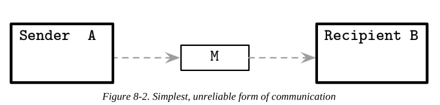
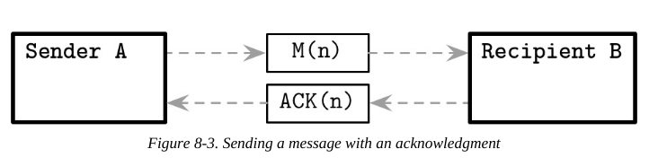
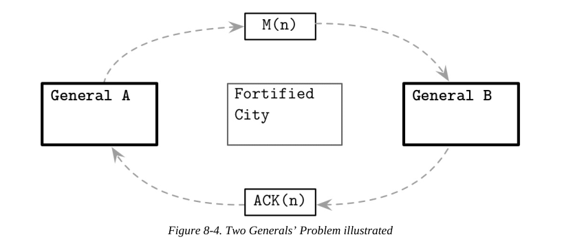

# Chapter 8
## Concurrent Execution
- У concurrent execution есть некоторые задачи, которые актуальны и для распределённых систем.
    - Consistency
    - Поток получает доступ к общим значениям, делает в них изменения, а затем распространяет эти изменения
- CONCURRENT AND PARALLEL
    - При Concurrency программа всегда выполняет один поток, однако часто переключается между ними, поэтому создаётся ощущение, что они работают одновременно.
    - При Parallelism части программы действительно выполняются одновременно и независимо друг от друга.

## Fallacies of Distributed Computing
### Processing
- Когда приходит сообщение, то оно помещается в очередь запросов, но эта очередь не бесконечна. Однако её увеличение не сделает лучше для системы.
    - Увеличение очереди запросов может повлечь высокий `latency`
- `Backpressure` - стратегия при которой продьюсеры (producers)  специально замедляются, чтобы консюмер (consumer) мог обработать запросы. 
    - Данная стратегия зачастую является неоптимальной

Я не очень понял, что такое process-local queue, но, видимо, это очередь сообщений в процесс или программу, которая находится на той же машине.

В основном process-local очереди стараются достичь следующих целей:
- Decoupling
    - Получение и обработка ответов разделены и происходят в разное время
- Pipelining
    - Запрос на разных стадиях обрабатывается разными частями системы
- Absorbing short-time bursts
    - Позволяет лучше обрабатывать взрывы активности 
    - Может создать `latency`, однако это лучше, чем retrying (повторять запрос) или failure 

Размер очереди сильно зависит от приложения и нагрузки на него. Важно учитывать возможное резкое увеличение нагрузки.

### Clocks and Time
- **Нельзя** полагаться на то, что:
    - `latency` = 0
    - обработка запросов происходит моментально

### State Consistency
- Важно, чтобы в репликах хранилась та же ифнормация, что и в оригинале
- Некоторые системы допускают возможное несоответствие между репликами и решают эту проблему с помощью 
    - `conflict resolution`
        - возможность найти и разрешить разногласия в расошедшихся состояниях
    - `read-time data repair`
        - синхронизировать реплики во время чтения, если они возвращают разные результаты
- Если рассчитывать на то, что данные на всех нодах согласованы, то это может привести к ошибкам
- Например, в [Apache Cassandra был баг](databass.dev/links/46) из-за которого `propogate` схемы БД переносился на сервера в разное время. Из-за этого был шанс повреждения данных.
- Другой пример. Первый нод думает, что нужная ему информация хранится на втором ноде, и запрашивает данные у второго нода. Второй нод либо возвращает пустой ответ, либо какие-то другие данные, хотя на самом деле нужные данные лежали на третьем ноде.

### Local and Remote Execution
- Скрывать сложность за API иногда может быть опасно
    - concurrent access
    - paging
    - merges
- Внешние вызовы всегда более дорогостоящие (нужно отправить запрос, возможно переотправить запрос, дождаться ответа...), чем внутренние

### Need to Handle Failures
- Нельзя строить систему, рассчитывая, что все ноды всегда будут исправно работать
- Непонятно по какой причине ответ на запрос мог не прийти: запрос не дошёл, ответ не дошёл или нод не работает 
- Также может быть полезно использовать `heartbeat protocol` и `failure detector`

### Network Partitions and Partial Failures
- `Network Partitions` - это ситуация, когда несколько серверов или групп серверов не могут друг с другом взаимодействовать. 
    - Это может породить противоречивую информацию
    - Со стороны может выглядить, как будто система работает корректно, однако это не так
- Произойдёт самое худшее, что может произойти, поэтому разработчик должен продумывать системы с учётом всех нюансов.
- Крайне важно тестировать системы в самых сложных условиях:
    - `network partitions`
    - большой `latency`
    - разное время на нодах

### Cascading failures
- circuit breakers
    - **Проблема:** даже если сервер отвечает медленно и часто возвращает ошибки, то это никак не отслеживается, ничего с этим не делается
    - **Решение:** добавить `circuit breaker`, который бы анализировал среднее время ответов и среднюю частоту ошибок. Если время или частота превышают определённый threshold, то сервер временно закрывается на исправление ошибок. 
    - [подробнее про данный паттерн](https://habr.com/ru/companies/otus/articles/778574/)
    - побольше почитай
- `backoff strategy`
    - **Проблема на примере**: представим себе, что к перегруженному серверу пытаются подключиться клиенты. Т.к. сервер итак перегружен, то часто сервер не отвечает -> Клиенты пытаются подключиться повторно -> Нагрузка увеличивается ещё сильнее 
    - **Решение:** если клиент не может подключиться к серверу то retries происходят с каким-то интервалом.
- `jitter`
    - **Проблема**: Если у всех клиентов одинаковая `backoff strategy`, то это не так эффективно 
    - **Решение**: Стоит добавлять рандомную задержку перед следующей попыткой подключения.
- `validation`
    - **Проблема:** Если данные на одном ноде повреждены, то он может начать `propogate` эту ошибку на другие ноды.
    - **Решение:** Добавить валидацию при отправке и получении данных.
- `coordination mechanisms`
    - **Проблема:** hotspotting, overload
    - **Решение:** должен существовать координатор, который создаёт execution plan на основе доступных ресурсов и прогнозирует нагрузку, полагаясь на execution data в прошлом  

## Distributed Systems Abstractions
Здесь собраны основные термины, которые используются в разговорах/книгах/статьях System Design. 

### Links

#### Fair-loss link

После того, как Отправитель A отправил сообщение M Получателю B, для отправителя сообщение может иметь следующие состояния:
- Ещё не доставлено процессу B
- Потеряно во время транспортировки
- Успешно передано процессу 

Обратите внимание, что при такой связи (`link`) отправитель никак не может узнать, доставлено ли сообщение. Свойства данной связи (`link`):
- `Fair loss`
    - Если и отправитель и получатель корректны И отправитель продолжает переотправлять сообщение бесконечное количество раз, то оно в конце концов будет доставлено.
- `Finite duplication`
    - Отправленные сообщения не будут доставлены бесконечное количество раз
- `No creation`
    - A link will not come up with messages; in other words, it won’t deliver the message that was never sent (я не понял, что за бред тут написан, поэтому просто скопировал-вставил текст из книги).

Мы можем предположить, что данная связь не теряет сообщения **систематично** и не создаёт новые сообщения. Однако полностью положиться на такую связь нельзя. Связь напоминает `UDP`

### Message acknowledgments
Чтобы получить больше ясности, мы можем ввести `acknowledgements`: способ получателя оповестить отправителя о том, что запрос был получен.

Для того, чтобы это реализовать, нужно следующее:
- bidirectional communication channels
- способ отличать сообщения друг от друга (какой-нибудь `id`)

acknowledgement может быть потерян
<!-- - кол-во возможных состояний увеличивается -->

Возможные состояния, в которых может находится сообщение, для отправителя не меняется, однако, как только acknowledgement получен, отправитель полностью уверен, что сообщение было получено

... Короче мне эта секция вообще не понравилась (`Links`), дальше конспект по ней писать не буду. Как будто абстракции не очень подобраны, хотя может вернусь 

## Two Generals’ Problem

Чтобы генералу A понять, что генерал B получил сообщение, генерал B должен отправить ACK(MSG(n)) генералу A. Чтобы генерал B удостоверился в том, что генерал A получил ACK(MSG(n)), генерал A должен тоже отправить ACK(ACK(MSG(n))). И так до бесконечности.

## FLP Impossibility
- **Проблема:** если на нодах противоречивые данные, то как им прийти к соглашению (`consensus`).
 - В любой момент любой из нодов может сломаться (причём может быть только временно)

- `consensus protoccol` описывает систему, в которой несколько процессов начинают с initial state, но затем она (система) приводит все процессы к `decision state`

Почему это важно?
- Помогает достичь realibility и consistency 

Основные свойства `consensus protocol`:
  - Agreement
    - Каждый процесс пришёл к определённому значнию, которое одинаково для всех процессов.
  - Validity
    - Значение, к которому пришли, должно было быть предложено одним из нодов. Оно не может быть просто рандомным или дефолтным.
  - Termination
    - Все процессы в конечном итоге должны достичь решения.

В своей работе Фишер, Линч и Паттерсон (Fisher, Lynch, and Paterson) доказали, что в асинхронной системе невозможно гарантировать достижения консенсуса за определённое кол-во времени, если хотя бы один процесс может упасть (`crash`)

## System Synchrony
Критика асинхронных систем:
- Процессы не могут иметь произвольно разные скорости обработки
- Связи не занимают неопределённо долгое время для доставки сообщений.

Возможно в 99% случаев эти условия соблюдаются и в асинхронных системах, однако если эти условия будут нарушены, то система должна быть к этому готова

## Failure Models
существуют разные модели failure

... не дописал главу
