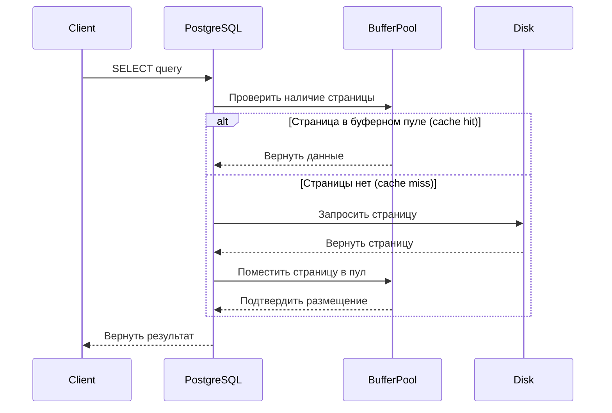
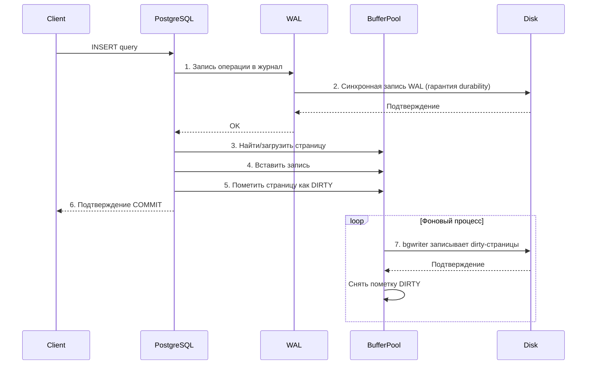
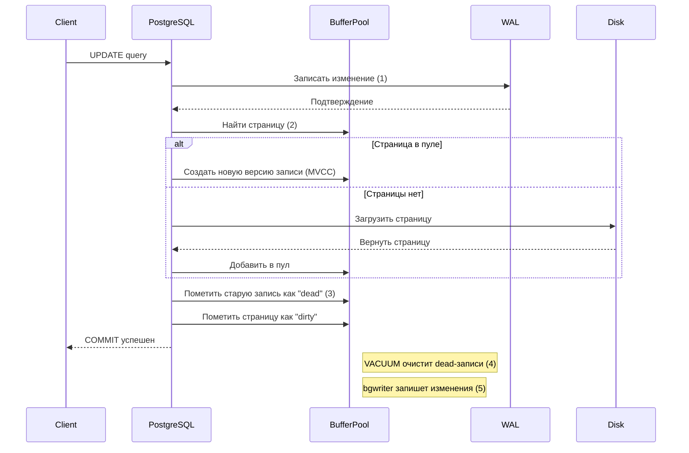
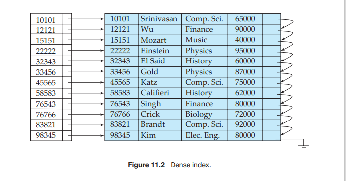
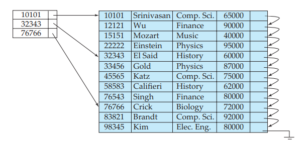
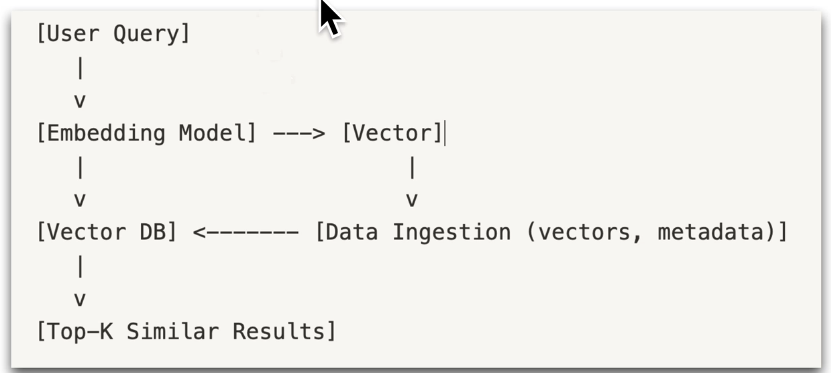

# Устройство БД (PostgreSQL)
## Пейджинг
- Каждая запись представляет собой кортеж
- Записи пишутся в страницы (`pages`)
    - Каждая страница имеет фиксированное кол-во занимаемой памяти (напр. 8 кб)
- В начале каждой страницы хранятся указатели на записи (offset, length)
    - что-то типа: 
    ```
        [ Item pointers: 4-byte1, 10-byte2 ... | Free space | ... Record2: 'Vlad' | Record1: ... ]
    ```
- Если тип столбца `VARCHAR(255)`, то это не значит, что под каждое поле этого столбца будет выделяться 255 байт, т.к. это было бы затратно. Выделяется только нужное кол-во памяти.
    - **ПРОБЛЕМА**: что делать с `UPDATE` и `DELETE`? 
    - `UPDATE` может увеличить размер котрежа, поэтому его length изменится. Не будем же мы двигать все записи после редактируемой записи? Как это решить?
    - `DELETE` может удалить запись, тогда в странице (`page`) появится неиспользуемое простанство. Не будем же мы двигать все записи после удаляемой записи?
    - **РЕШЕНИЕ**: VACCUM и мёртвые (`dead`) записи. Если запись удалена, то она помечается, как мёртвая. Если обновленный кортеж записи занимает больше места, чем занимал раньше, то старый offset помечается, как мёртвый, а затем создаётся новая запись (может быть даже в другой странице). Затем, если вызывать `VACCUM` (местный Garbage Collector), то все мёртвые записи удаляются и записи в пейджах сдвигаются, offset'ы обновляются.
    - **ПРИМЕР**:
    ```
    Исходная страница:
    [ Item pointers: 4-byte1, 10-byte2 ... | Free space | ... Record2: 'Vlad' | Record1: ... ]

    После обновления Record2 на 'SomeLongNameIDK' (если места (`long`) в кортеже хватает):
    [ Item pointers: 4-byte1, 10-byte2* ... | Free space↓ ... | Record2 (new): 'SomeLongNameIDK' | Record1... ]

    Если места в котреже не хватает:
    [ Item pointers: 4-byte1, 10-byte2 (dead) ... | ... Record2 (dead): 'Vlad' | ... ]
    Новая запись 'SomeLongNameIDK' пишется в другую страницу.
    ```

## Колоночные БД
- В колоночных БД в каждой странице значения одного конкретного столбца.
- ✅ Это удобно для аналитики данных
- ❌ Медленное обновление записей
- Пример: ClickHouse

### Чем отличается от строчной (на примере)?
Чтобы понять разницу между колоночными и строчными (обычными) можно привести пример:
- у нас есть данные:

|col1|col2|col3|
|- | - | - |
|val1|val2|val3|
|val4|val5|val6|
|...|...|...|
|val1000|val1001|val1002|

- Как бы эти данные записались в **колоночной** БД:
    - `page1` (col1): 
    ```
    [val1, val4, ..., val1000]
    ```
    - `page2` (col2): 
    ```
    [val2, val5, ..., val1001]
    ```
    - `page3` (col3): 
    ```
    [val3, val6, ..., val1002]
    ```
- Как бы эти данные записались в **строчной** БД:
    - `page1`:
    ```
    [ 
        [ val1, val2, val3 ],
        [ val4, val5, val6 ],
        ...
    ]
    ```
    - `page10`:
    ```
    [ 
        ...
        [ val1000, val1001, val1002 ]
    ]
    ```

# Buffer Pool (page cache)
**Внимание**, я не очень понял эту тему, поэтому может тут некорректная инфа какая-то. В основном основывался на воспоминаниях с лекции, DSC и дипсике

## Что это?
Buffer Pool - это кеш БД с часто используемыми страницами (пейджами)

## Как определяется, что хранить в Buffer Pool?
- В Buffer Pool хранятся наиболее часто используемые пейджи
- Есть возможность "запинить" наиболее важные пейджи, чтобы они в любом случае не уходили из Buffer Pool (даже если не часто используются)
- Работает примерно так же, как LRU cache

## Что происходит при чтении (`SELECT`)?
- Запрос: "Прочитать страницу 5 таблицы users".



## Что происходит при записи (`UPDATE`, `INSERT`)?
- **Изменения не сразу пишутся на диск**!
- `INSERT`

- `UPDATE`


## WAL (Write-Ahead Log)
- даже если данные не записаны на диск, изменения сначала фиксируются в WAL.
- При сбое данные восстанавливаются из WAL + Buffer Pool.

# Индексы
## Кластеры
Бывают кластеризированные и не кластаризированные индексы.
- Кластаризированные:
    - Медленнее добавление
    - Быстрее чтение
    - Даёт преимущество при работе с диапозоном
    - Хранит данные в листьях индекса
    - Значения отсортированны в определённом порядке
- Не кластеризированные:
    - Быстрее добавление данных
    - Медленнее чтение
    - Содержит не сами данные, а только ссылки на их расположение в таблице


## Разряженные/плотные индексы
- While a Dense Index creates an entry for every record in the database, a Sparse Index only does so for a select subset, primarily the first record of each block.

- Плотные индексы



- Разряженные индексы


## B Tree
- почти не используется, потому что есть B+Tree
- быстрый поиск
- медленное добавление

- пока не понял (пополню позже)

## B+Tree


- пока не понял (пополню позже)

## Trie
- префиксное дерево
- пока не понял (пополню позже)

## Bitmaps
- Удобно для enum'ов.
- 

| name | sex(( |salary |
| -- | -- | - |
| Brat Vachevski | f | L1 |
| Thom York | m | L3 |
| Chino Moreno | m | L1 |
| Courtney Love | f | L3 |
| James Hetfield | m | L2 |

->
- sex
    - m = [0, 1, 1, 0, 1]
    - f = [1, 0, 0, 1, 0]
- salary
    - L1 = [1, 0, 1, 0, 0]
    - L2 = [0, 0, 0, 0, 1]
    - L3 = [0, 1, 0, 1, 0]
- можно быстро найти пересечения.
    - Например, найти имена всех мужчин (m) с зарплатой (salary) L1
        - берём и побитово умножаем m (01101) на L1 (10100), получается 00100. 
        - значит, что Chino Moreno сюда подходит

## GIST
- пока не понял (пополню позже)

## Inverted Index
- в словах поиск
- разбиваетЫ весь текст по словам ёпта

## R Tree
- B tree, но с геометрией
- При добавлении точек может произойти ребалансировка
- пока не понял (пополню позже)

## Hash
- хорош для поиска конкретного значения
- плох для сравнения (inx > 69)

# Embedded models
- Интеграция моделей машинного обучения напрямую в СУБД.
- Позволяет обрабатывать данные внутри базы, избегая перемещения больших объёмов информации во внешние системы.
- Ключевой аспект - **работа с векторными данными**.



# ***САМОЕ ВАЖНОЕ***
Владу часы:
- [seiko](https://www.grand-seiko.com/id-id/collections/sbga413g)
- ещё чет было


